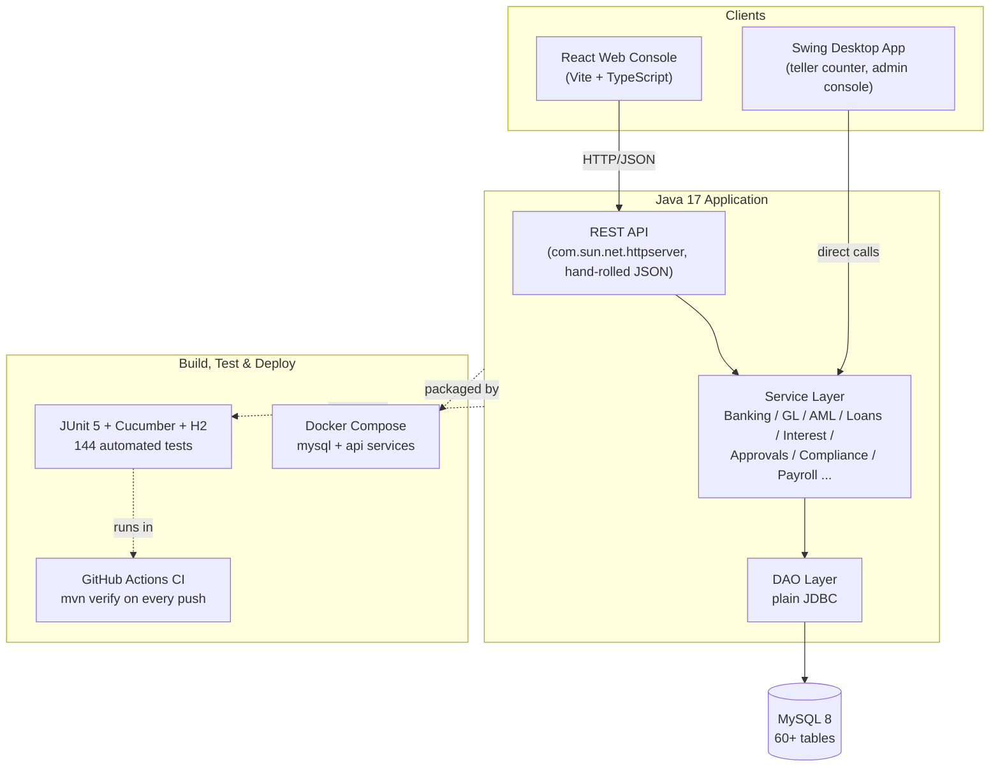
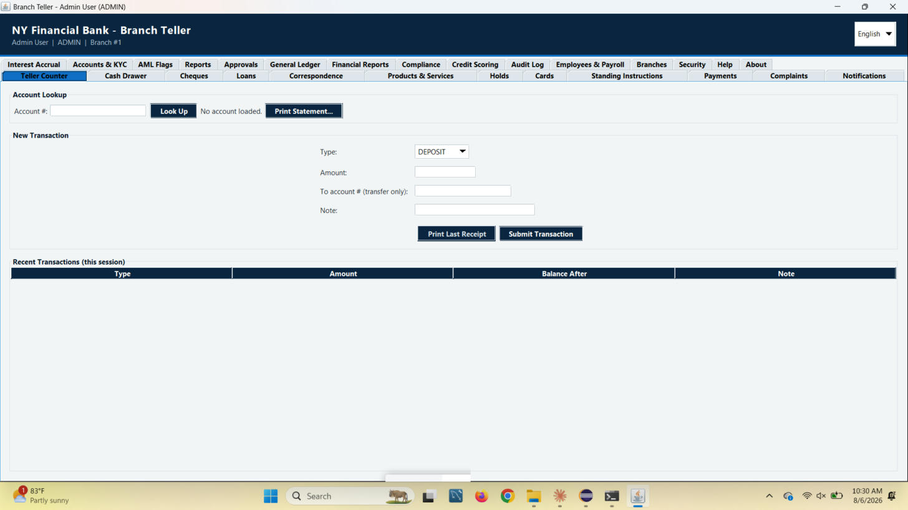
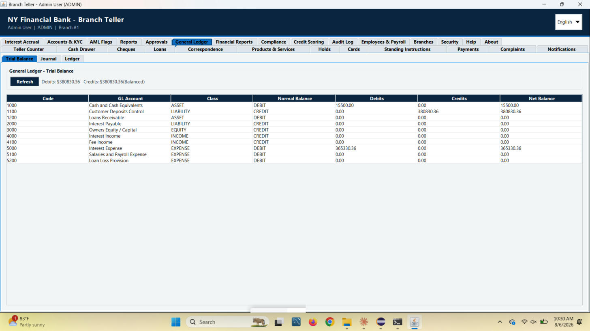
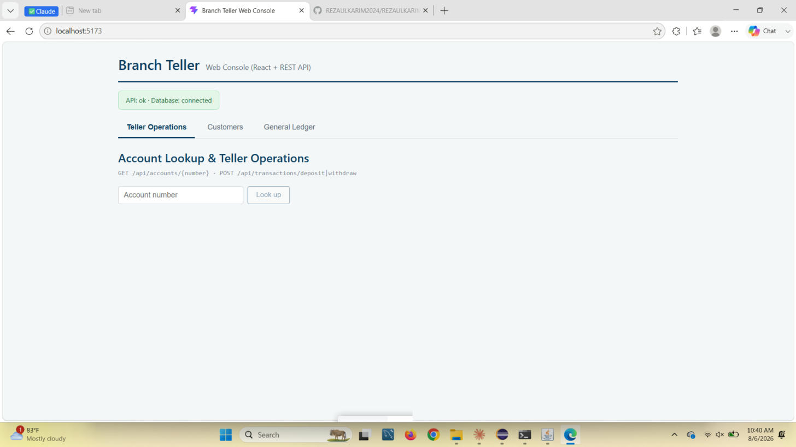

# Branch Teller — Bank Branch Operations Platform

A full-stack core banking simulation: a Java Swing teller desktop application backed by
MySQL, a zero-dependency REST API layer, a React web console, an automated test suite,
CI, and containerized deployment. Built as an end-to-end demonstration of how a
mid-size retail bank branch's counter operations, general ledger, compliance, and
back-office workflows fit together — not a toy CRUD app.


[](https://github.com/REZAULKARIM2024/branch-teller-pos/actions/workflows/ci.yml)


## Table of Contents

- [Overview](#overview)
- [Architecture](#architecture)
- [Screenshots](#screenshots)
- [Features](#features)
- [Tech Stack](#tech-stack)
- [Prerequisites](#prerequisites)
- [Installation](#installation)
- [Configuration](#configuration)
- [Running the Application](#running-the-application)
- [Default Login](#default-login)
- [Project Structure](#project-structure)
- [Database Overview](#database-overview)
- [Testing](#testing)
- [Test Database Strategy](#test-database-strategy)
- [Test Reporting (Allure)](#test-reporting-allure)
- [BDD Testing (Cucumber)](#bdd-testing-cucumber)
- [REST API](#rest-api)
- [React Web Console](#react-web-console)
- [Running with Docker](#running-with-docker)
- [CI/CD Pipeline](#cicd-pipeline)
- [Known Simplifications](#known-simplifications)
- [Roadmap](#roadmap)
- [Contributing](#contributing)
- [License](#license)
- [Contact](#contact)

## Overview

Branch Teller models a single bank branch from the teller counter outward: account
opening and KYC, deposits/withdrawals/transfers, cheque clearing, loans with amortizing
EMI schedules, monthly interest accrual, a full double-entry general ledger, AML
transaction monitoring, maker-checker dual-control approvals, card management, standing
instructions, multi-branch support, credit scoring, and a compliance/CRM layer for
complaints and regulatory reporting. Every balance-changing action is atomic and
audit-logged.

The same service layer is exposed three ways: a native Swing desktop client for
tellers, a REST/JSON API, and a React web console that consumes that API — proving the
business logic isn't tangled up with any one UI.

## Architecture



## Screenshots

**Swing teller counter** — account lookup, deposit/withdraw entry, and the session's
recent-transactions log:



**General Ledger — Trial Balance** — the live chart of accounts, debits/credits, and
balanced-check straight from the double-entry ledger:



**React web console** — the same account-lookup/teller flow consumed over the REST API
from a browser, with a live API/DB health banner:



## Features

### Core Banking
- Account opening with a KYC workflow (pending/verified/rejected), deposit/withdraw/transfer, all wrapped in atomic JDBC transactions with an audit-trail row written alongside every balance change.
- Role-based login (ADMIN / MANAGER / TELLER-style roles) with a simulated OTP two-factor step.

### Cash & Branch Operations
- Cash drawer paid-in/paid-out/no-sale/till-count logging.
- Cheque deposit → clearing/bounce queue.
- Receipt and statement printing, and a bank-letter Correspondence module.
- Multi-branch support.

### Lending
- Loan origination, manager approval, disbursement, and full amortizing EMI schedule generation and repayment tracking.
- Credit scoring/underwriting.

### General Ledger & Interest
- A real double-entry chart of accounts (assets/liabilities/equity/income/expense), trial balance, journal, per-account ledger view, balance sheet, income statement, and a classified cash flow statement (operating/investing/financing).
- Idempotent monthly interest accrual per account/period, posting both to customer balances and to the general ledger (Interest Expense vs. Customer Deposits Control).

### Compliance & Risk
- AML flagging on transactions over a reporting threshold.
- Maker-checker dual-control approvals for large transactions.
- Complaint/CRM tracking and a regulatory report (CTR/SAR-style) export.

### Platform Operations
- Card issuance/management, standing instructions (auto-pay), customer notifications, employee records + payroll, and a simulated external payment network.
- 5-locale i18n (English, Bangla, Arabic, Spanish, French).
- A REST API surface and a React web console covering account lookup, teller deposit/withdraw, the customer list, and the GL trial balance.

## Tech Stack

| Layer | Technology |
|---|---|
| Desktop client | Java 17, Swing, custom theming/i18n (5 locales) |
| Web client | React 19, TypeScript, Vite |
| Backend | Java 17, JDBC, `com.sun.net.httpserver` (zero-dependency REST) |
| Database | MySQL 8.0 |
| Testing (backend) | JUnit 5, Cucumber 7, H2 (in-memory integration tests) |
| Testing (frontend) | Vitest, Testing Library, jsdom |
| Test Reporting | Allure (`allure-junit5`, `allure-cucumber7-jvm`, `allure-maven`) |
| CI/CD | GitHub Actions (`mvn verify` + Allure report published to GitHub Pages on every push) |
| Containerization | Docker (multi-stage build), Docker Compose |
| Build | Maven (`exec-maven-plugin` for zero-classpath-hassle local runs) |

No Spring, no Hibernate, no Jackson — the service/DAO/API layers are built directly on
the JDK and JDBC. That's a deliberate choice to keep the request path (HTTP → JSON →
service → JDBC → MySQL) fully inspectable end to end.

## Prerequisites

- JDK 17+
- MySQL 8.x (not required if you only want to run the automated test suite — that runs against H2)
- Maven 3.8+
- Node 18+ (only needed for the `frontend/` web console)

## Installation

1. **Clone the repository**
   ```bash
   git clone https://github.com/REZAULKARIM2024/branch-teller-pos.git
   cd branch-teller-pos
   ```
2. **Install MySQL and load the schema**
   ```bash
   mysql -u root -p < database/schema.sql
   # then apply the phase migration scripts in database/ in order, or use
   # docker/initdb/ which already has them numbered correctly (see Running with Docker)
   ```
3. **The MySQL connector is a normal Maven dependency** (`com.mysql:mysql-connector-j:9.7.0` in `pom.xml`) — no jar to hand-download or vendor; `mvn compile` / `mvn exec:java` resolve it automatically.
4. **Import into your IDE.** In Eclipse: File → Import → Existing Maven Projects → select this folder. Maven resolves all dependencies (including the test/reporting toolchain) from `pom.xml`.

## Configuration

`DBConnection` reads its connection details from environment variables, falling back to
sensible local defaults if they're unset:

```java
DB_URL      = "jdbc:mysql://localhost:3306/branch_teller"   // env: DB_URL
DB_USER     = "root"                                        // env: DB_USER
DB_PASSWORD = "admin123"                                     // env: DB_PASSWORD
```

`ApiServer`'s listen port likewise defaults to `8082` and can be overridden with the
`API_PORT` environment variable.

## Running the Application

- **Desktop app:**
  ```bash
  mvn compile exec:java -Dexec.mainClass=com.branchteller.Main
  # or after `mvn package`:
  java -jar target/branch-teller-pos.jar
  ```
  On Windows, `run_app.bat` does the same thing with a double-click.
- **REST API:**
  ```bash
  mvn compile exec:java -Dexec.mainClass=com.branchteller.api.ApiServer
  # listens on http://localhost:8082 (override with API_PORT)
  ```
  On Windows, `run_api_server.bat` does the same thing with a double-click.
- **React web console:**
  ```bash
  cd frontend
  npm install
  npm run dev
  # open the printed local URL (usually http://localhost:5173)
  ```
  On Windows, `run_frontend.bat` runs `npm install` (first time only) and `npm run dev` with a double-click.
- **Everything at once:** see [Running with Docker](#running-with-docker) below.

## Default Login

Demo users ship with placeholder password hashes (`CHANGE_ME_HASH` / `CHANGE_ME_SALT`)
in the base schema, so nobody can log in until real hashes are generated:

```bash
mvn compile
java -cp target/classes com.branchteller.util.PasswordUtil <your-password>
```

This prints a salt and hash — update the `users` table with the printed values, or point
`DB_URL`/`DB_USER`/`DB_PASSWORD` at an already-seeded database.

The Docker Compose environment pre-bakes working demo credentials (see
`docker/initdb/04-demo-credentials.sql`) so `docker compose up` is login-ready out of
the box:

| Username | Password | Role |
|---|---|---|
| `admin` | `admin123` | ADMIN |
| `teller1` | `teller123` | TELLER |

## Project Structure

```
src/main/java/com/branchteller/
  config/    DBConnection — reads DB_URL/DB_USER/DB_PASSWORD env vars
  model/     Domain objects (Account, Customer, Transaction, Loan, GlAccount, ...) — 29 classes
  dao/       Plain-JDBC data access objects — 26 classes
  service/   Business logic — BankingService, GlService, AmlService, LoanService,
             InterestService, ApprovalService, ComplianceService, PayrollService, ... — 24 classes
  gui/       Swing panels — one per feature area (30 classes total)
  api/       ApiServer (REST/JSON), Json (hand-rolled reader/writer)
  i18n/      Messages.java — locale loader for the 5 message bundles
  util/      PasswordUtil, PrintableText
src/main/resources/i18n/
  messages.properties, messages_ar/_bn/_es/_fr.properties
src/test/java/com/branchteller/
  service/    Unit + H2-backed integration tests (interest math, approval thresholds,
              AML flagging, GL posting, end-to-end account lifecycle)
  dao/        Integration tests against an in-memory H2 database
  api/        HTTP integration tests against a running ApiServer
  model/      Role/permission matrix tests
  util/       PasswordUtil security tests
  docker/     Docker init-script contract test
  cucumber/   Gherkin step definitions + JUnit Platform Suite runner
  support/    Shared H2 schema/fixture helpers, shared test ApiServer singleton
src/test/resources/features/
  account_lifecycle.feature, api.feature   Gherkin scenarios (14 total)
database/
  schema.sql + phase-by-phase migration scripts (schema_phase8_expansion.sql,
  schema_phase17_19_catchup.sql, schema_phase20_gl_reports.sql)
docker/initdb/
  01-schema.sql, 02-phase8-expansion.sql, 03-phase20-gl-reports.sql,
  04-demo-credentials.sql   Numbered so MySQL loads them in the correct order
frontend/
  React + TypeScript web console (Vite) — src/api.ts client, src/components/ pages
docs/screenshots/
  Images referenced in this README
.github/workflows/
  ci.yml   GitHub Actions pipeline (mvn verify, Allure report published to GitHub Pages)
Dockerfile, docker-compose.yml
  Multi-stage API build + one-command mysql/api local spin-up
run_app.bat, run_api_server.bat, run_frontend.bat
  Windows double-click launchers, all running through Maven's own dependency-resolved
  classpath (no hand-copied driver jars)
```

117 Java source files across the layers above, plus the React frontend.

## Database Overview

Key tables in `branch_teller` (60+ total; grouped here by feature area):

| Area | Tables |
|---|---|
| Customers & accounts | `customers`, `accounts`, `transactions` |
| KYC & audit | `kyc_status` fields on `customers`, `audit_log` |
| Cash & cheques | `cash_drawer_log`, `cheques` |
| Loans | `loans`, `loan_repayments` |
| Interest | `interest_accruals` |
| General ledger | `gl_accounts`, `gl_journal`, `gl_entry_lines` |
| Compliance | `aml_flags`, `approvals`, `complaints`, `regulatory_reports` |
| Cards & instructions | `cards`, `standing_instructions` |
| Branches & staff | `branches`, `employees`, `payroll_runs` |
| Platform | `users`, `notifications`, `credit_scores`, `payment_network_log` |

See `database/schema.sql` and the phase migration scripts in that same directory for the
complete definitions.

## Testing

144 automated tests across two engines, both run by a single command (and in CI on
every push via `.github/workflows/ci.yml`):

```bash
mvn verify
```

- **JUnit 5** (130 tests) — pure-logic unit tests (interest math, approval thresholds,
  password hashing, role permissions), H2-backed integration tests (general ledger
  posting/trial-balance correctness, full deposit/withdraw/transfer/AML/approval/
  interest-accrual flows against an in-memory database), and real HTTP integration
  tests against a running `ApiServer` instance:
  - `BankingServiceValidationTest`, `PasswordUtilTest`, `UserPermissionTest` — pure/negative/data-driven
  - `AmlServiceTest`, `GlServicePostTest`, `GlDaoIntegrationTest` — self-contained H2 connections
  - `InterestServiceTest`, `ApprovalServiceTest` — `@ParameterizedTest` boundary sweeps
  - `EndToEndFlowTest` — full onboarding → KYC → account → transact → AML → approval → interest-accrual flow
  - `ApiServerIntegrationTest` — live HTTP tests against `ApiServer`
  - `DockerInitScriptsTest` — verifies the Docker init-script contract (numbered, no gaps, non-empty)
- **Cucumber** (14 scenarios) — the same account-lifecycle and API flows expressed as
  Gherkin `.feature` files under `src/test/resources/features/`, run through the JUnit
  Platform Suite engine (`cucumber/RunCucumberTest.java`).

**Frontend tests** (React components, via Vitest + Testing Library):

```bash
cd frontend
npm install
npm test               # 16 tests, headless (jsdom)
npm run test:coverage  # same, with a coverage report
```

Covers `HealthBanner`, `CustomersPage`, `AccountsPage` (including the deposit flow and
error states), and `TrialBalancePage` — including basic accessibility checks via
`getByLabelText`/`getByPlaceholderText`.

## Test Database Strategy

Every backend test that needs a database runs against H2 in-memory — no MySQL server
needed to run the suite. `DBConnection` itself is untouched; Maven Surefire points its
`DB_URL`/`DB_USER`/`DB_PASSWORD` environment variables at H2 for the test JVM only (see
the `<environmentVariables>` block in `pom.xml`), via `src/test/java/com/branchteller/support/TestDatabase.java`.
Two patterns are used depending on what a test needs:

1. **Self-contained H2 connections** — for tests that call methods accepting a
   `Connection` parameter directly (e.g. `GlService.post()`, `AmlService.checkAndFlag()`).
2. **Shared, environment-configured H2 instance** (`jdbc:h2:mem:branchteller_test;DB_CLOSE_DELAY=-1`)
   — for testing top-level service methods that internally call `DBConnection.getConnection()`.

`ApiServerIntegrationTest` and Cucumber's `ApiSteps` share a single `TestApiServer`
singleton (`support/TestApiServer.java`) so both can drive a running `ApiServer` instance
without a port-collision race within the same Surefire-forked JVM.

## Test Reporting (Allure)

```bash
mvn verify                                          # runs everything, writes raw results
mvn io.qameta.allure:allure-maven:2.15.2:report      # target/site/allure-maven-plugin/index.html
```

Allure's results (from both the JUnit5 and Cucumber test runs, via the
`allure-junit5` and `allure-cucumber7-jvm` adapters) land in `target/allure-results` and
get turned into a browsable report by the command above. Because it's a client-side app
that fetches its data as JSON, **open it over `http://`, not by double-clicking the
file** — either serve `target/site/allure-maven-plugin` with any static file server, or:

```bash
mvn io.qameta.allure:allure-maven:2.15.2:serve
```

which downloads the Allure commandline tool on first run and opens the report directly
in your browser.

CI publishes this same report to GitHub Pages on every push, so it's viewable live
without anyone needing Maven installed at all — see [CI/CD Pipeline](#cicd-pipeline).

Cucumber's own HTML/JSON reports are written directly to `target/cucumber-report/` on
every `mvn verify` run (no extra command needed) — that one *is* a self-contained file
and opens fine directly.

## BDD Testing (Cucumber)

`src/test/resources/features/account_lifecycle.feature` (7 scenarios) and `api.feature`
(7 scenarios) express the same core flows as Gherkin, readable by non-programmers:

```gherkin
Scenario: A teller-limit-exceeding withdrawal is queued for manager approval
  Given a customer with a verified KYC status and an active account
  When a teller submits a withdrawal above the teller approval limit
  Then the transaction is queued as a pending approval
  And a manager can approve it to complete the withdrawal
```

Step definitions live in `src/test/java/com/branchteller/cucumber/steps/`
(`BankingSteps.java`, `ApiSteps.java`), run through the JUnit Platform Suite runner
(`RunCucumberTest.java`) as part of `mvn verify` — no separate command needed.

## REST API

`com.branchteller.api.ApiServer` exposes the same service layer over HTTP/JSON, built
entirely on `com.sun.net.httpserver.HttpServer` and a hand-rolled JSON reader/writer
(`Json.java`) — no Spring or Jackson, same zero-dependency philosophy as the rest of the
backend.

```bash
mvn compile exec:java -Dexec.mainClass=com.branchteller.api.ApiServer
# listens on http://localhost:8082 by default
```

| Method | Endpoint | Description |
|---|---|---|
| GET | `/api/health` | Service + DB connectivity status |
| GET | `/api/customers` | List all customers |
| GET | `/api/accounts/{number}` | Look up one account by number |
| GET | `/api/accounts/{number}/transactions` | *(reserved — not yet implemented; returns 501)* |
| POST | `/api/transactions/deposit` | Deposit into an account |
| POST | `/api/transactions/withdraw` | Withdraw from an account |
| GET | `/api/gl/trial-balance` | The live GL trial balance |

Every endpoint responds to `OPTIONS` for CORS preflight, so the React console (or any
browser client) can call it directly from `localhost:5173` during local development.

## React Web Console

A small React + TypeScript (Vite) app under `frontend/` consumes the REST API above —
account lookup, teller deposit/withdraw, the customer list, and the GL trial balance,
plus a live health banner showing API/DB connectivity:

```bash
cd frontend
npm install
cp .env.example .env   # point VITE_API_BASE_URL at your running API if not on localhost:8082
npm run dev
```

Pages: `HealthBanner`, `CustomersPage`, `AccountsPage`, `TrialBalancePage` — each with a
matching Vitest test file (see [Testing](#testing)).

## Running with Docker

```bash
docker compose up
```

Brings up MySQL (seeded with schema + demo credentials via `docker/initdb/`, numbered
01–04 for correct load order) and the REST API on port 8082 — see
[Default Login](#default-login) for the demo credentials. `DBConnection` reads its
connection details from environment variables with the original hardcoded values as
defaults, so this required no changes to any existing non-Docker workflow. The Swing
desktop app is a GUI and isn't a good fit for a container — Docker here covers the API +
database only; run the desktop app directly against the same (or a locally seeded)
database.

## CI/CD Pipeline

`.github/workflows/ci.yml` runs on every push/PR to `main`:

1. Checks out the repo and sets up JDK 17 (Temurin, with Maven dependency caching).
2. Runs `mvn -B verify` — the full 144-test suite (JUnit 5 + Cucumber) against H2, no
   MySQL service container needed.
3. Uploads the Surefire and Cucumber HTML reports as build artifacts, even if a step
   fails.
4. Generates the Allure report (`mvn allure:report`) and publishes it straight to the
   `gh-pages` branch via `peaceiris/actions-gh-pages`, so it's viewable live at
   `https://REZAULKARIM2024.github.io/branch-teller-pos/` without anyone needing Maven
   installed.

The badge at the top of this README reflects the latest run.

## Known Simplifications

This is a demonstration/portfolio project, not a production banking system. A few
things are deliberately simplified rather than production-grade: AML logic is a flat
transaction-amount threshold (not real CTR/SAR rule engines), regulatory export is a
generic CSV rather than a government filing format, payroll withholding is a single
flat rate rather than itemized tax brackets, the REST API is unauthenticated (intended
for local/internal use), and the React web console covers a representative subset of
the API (account lookup/deposit/withdraw, customers, GL trial balance) rather than full
feature parity with the Swing app.

## Roadmap

- Live cloud deployment of the API + React frontend (Render/Railway/Fly.io/AWS) for a
  clickable demo URL
- Code coverage reporting (JaCoCo) with a quality gate, similar to the reporting layer
  already in place for test results
- An AI/LLM-powered feature — e.g. natural-language explanation of AML flags or GL
  trial-balance variances
- Basic performance/load testing (currently out of scope)
- Security scanning in CI (Dependabot/Snyk/OWASP dependency-check)
- Basic observability/structured logging
- REST API authentication

## Contributing

This is currently a single-owner project. Issues and pull requests are welcome — please
open an issue describing the change before submitting a PR so the approach can be
discussed first.

## License

Internal/demo project — not licensed for production banking use. This is a portfolio
project simulating core banking operations; it is not connected to any real financial
institution, payment network, or live customer data.

## Contact

**Rezaul Karim**

[LinkedIn](https://www.linkedin.com/in/rezaul-karim-803a3b273)
